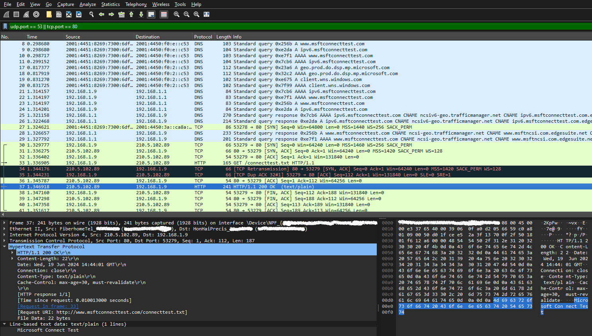
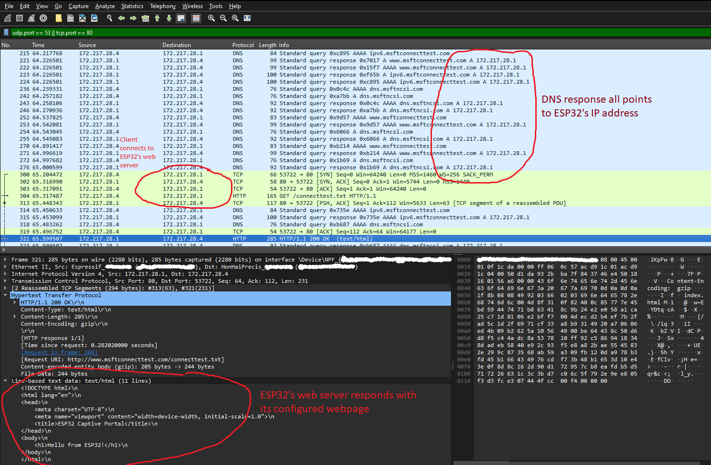

# About

The ESP32 Captive Portal uses DNS hijacking to trigger a pop-up web page on the client's device each time it connects to the ESP32's access point. The ESP32 sets up an access point with an IP address and gateway of `172.217.8.1` and a subnet mask of `255.255.255.0`. It then creates an HTTP web server on port `80` to handle all HTTP GET requests, regardless of the endpoint. Additionally, it establishes a DNS server on port `53` to intercept incoming DNS queries. For every DNS query, the ESP32's DNS server responds with the IP address `172.217.8.1`.

## Network Communication Flowchart

    

## Network Analysis using Wireshark

### Normal traffic when a client connects to an access point

    

<h4>
    The client receives the correct IP address for each domain and performs an HTTP GET request to http://www.msftconnecttest.com/connecttest.txt. In response, it receives plain text data containing the message "Microsoft Connect Test".
</h4>

### Hijacked DNS

<h4>This happens when a client connects to the ESP32's access point</h4>

    

<h4>
    For all DNS queries from a client, it receives the IP address 172.217.8.1, which is the IP address of the ESP32. This causes the client to always perform an HTTP GET request to 172.217.8.1 whenever it queries the IP address of any domain. When the client receives an HTTP GET response, a pop-up browser will display a webpage with the text "Hello from ESP32!".
</h4>

## Demo of Captive Portal

https://github.com/johndeweyzxc/ESP32-Web-Captive-Portal/assets/107840996/86c5d05a-add7-45b0-89fa-d4c006b45c1c

## Disclaimer

<h4 align="start">
    Usage of all tools on this project for attacking targets without prior mutual consent is ILLEGAL. It is the end user’s responsibility to obey all applicable local, state, and federal laws. I assume no liability and are not responsible for any misuse or damage caused by this project or software.
</h4>
